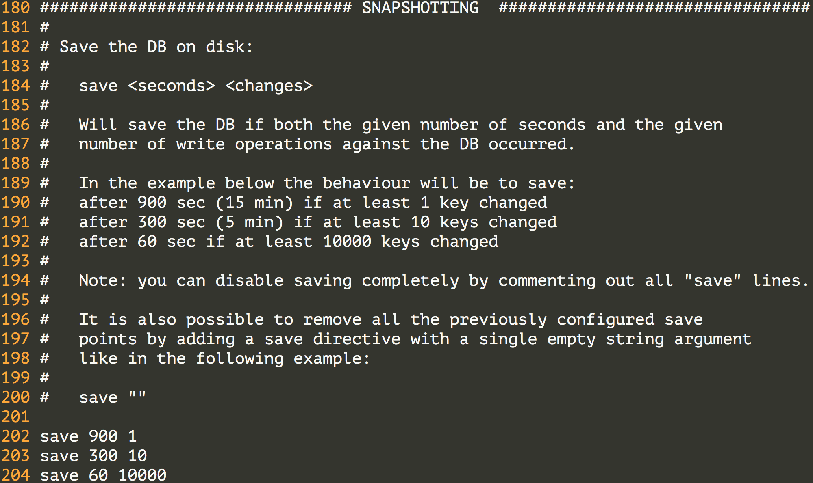
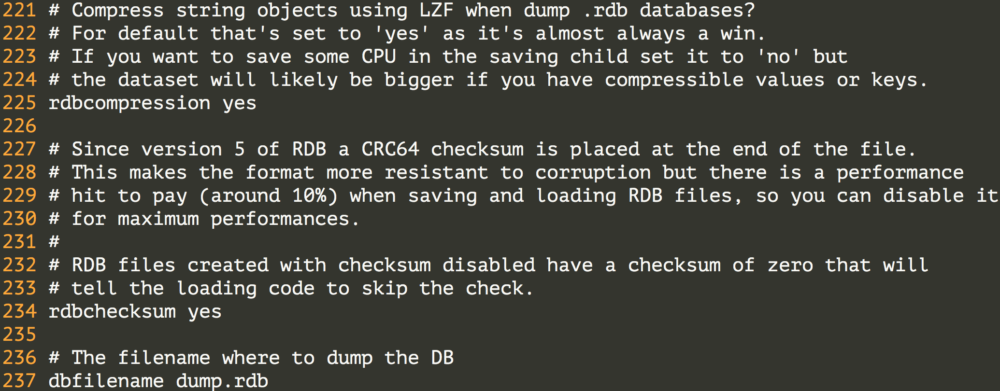
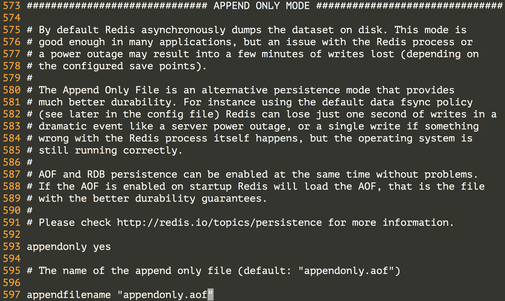
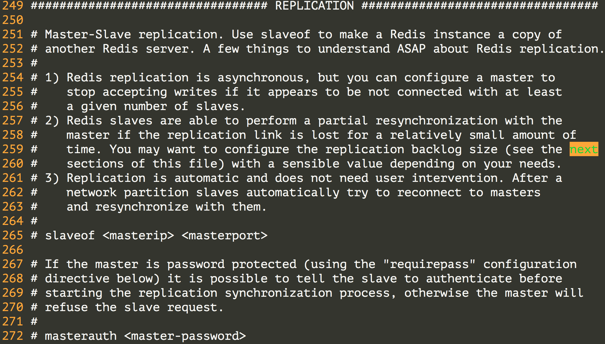
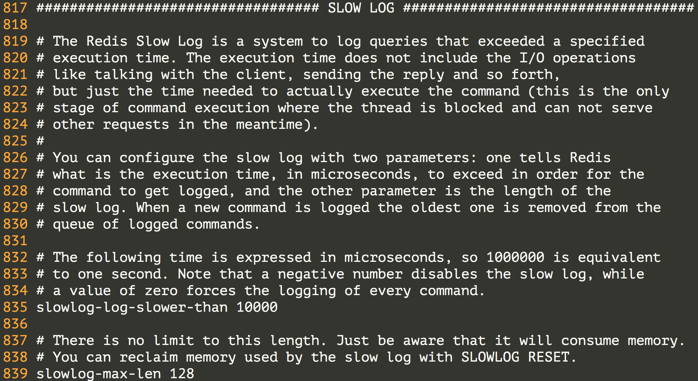

## 存储数据

### 数据缓存

通过前面章节的内容，我们已经知道了如何从指定的页面中抓取数据，以及如何保存抓取的结果，但是我们没有考虑过这么一种情况，就是我们可能需要从已经抓取过的页面中提取出更多的数据，重新去下载这些页面对于规模不大的网站倒是问题也不大，但是如果能够把这些页面缓存起来，对应用的性能会有明显的改善。

### 使用NoSQL

#### Redis简介

Redis是REmote DIctionary Server的缩写，它是一个用ANSI C编写的高性能的key-value存储系统，与其他的key-value存储系统相比，Redis有以下一些特点（也是优点）：

- Redis的读写性能极高，并且有丰富的特性（发布/订阅、事务、通知等）。
- Redis支持数据的持久化（RDB和AOF两种方式），可以将内存中的数据保存在磁盘中，重启的时候可以再次加载进行使用。
- Redis不仅仅支持简单的key-value类型的数据，同时还提供hash、list、set，zset、hyperloglog、geo等数据类型。
- Redis支持主从复制（实现读写分析）以及哨兵模式（监控master是否宕机并调整配置）。

#### Redis的安装和配置

可以使用Linux系统的包管理工具（如yum）来安装Redis，也可以通过在Redis的[官方网站](https://redis.io/)下载Redis的[源代码](http://download.redis.io/releases/redis-3.2.11.tar.gz)解压缩解归档之后进行构件安装。

```Shell

# wget http://download.redis.io/releases/redis-3.2.11.tar.gz
# gunzip redis-3.2.11.tar.gz
# tar -xvf redis-3.2.11.tar
# cd redis-3.2.11
# make && make install
```

接下来我们将redis-3.2.11目录下的redis.conf配置文件复制到用户主目录下并修改配置文件（如果你对配置文件不是很有把握就不要直接修改而是先复制一份再修改这个副本）。

```Shell

# cd ..
# cp redis-3.2.11/redis.conf redis.conf
# vim redis.conf
```

配置将Redis服务绑定到指定的IP地址和端口。


配置底层有多少个数据库。


配置Redis的持久化机制 - RDB。





配置Redis的持久化机制 - AOF。



配置访问Redis服务器的验证口令。


配置Redis的主从复制，通过主从复制可以实现读写分离。



配置慢查询日志。



这样我们就完成了Redis的基本配置，如果对上面的东西感到困惑，可以先系统的了解一下Redis，[《Redis开发与运维》](https://item.jd.com/12121730.html)是一本不错的入门读物，而[《Redis实战》](https://item.jd.com/11791607.html)是不错的进阶读物。

#### Redis的服务器和客户端

接下来启动Redis服务器，可以将服务器放在后台去运行。

```Shell

# redis-server redis.conf &

           _.-``__ ''-._
      _.-``    `.  `_.  ''-._           Redis 3.2.11 (00000000/0) 64 bit
  .-`` .-```.  ```\/    _.,_ ''-._
 (    '      ,       .-`  | `,    )     Running in standalone mode
 |`-._`-...-` __...-.``-._|'` _.-'|     Port: 6379
 |    `-._   `._    /     _.-'    |     PID: 12345
  `-._    `-._  `-./  _.-'    _.-'
 |`-._`-._    `-.__.-'    _.-'_.-'|
 |    `-._`-._        _.-'_.-'    |           http://redis.io
  `-._    `-._`-.__.-'_.-'    _.-'
 |`-._`-._    `-.__.-'    _.-'_.-'|
 |    `-._`-._        _.-'_.-'    |
  `-._    `-._`-.__.-'_.-'    _.-'
      `-._    `-.__.-'    _.-'
          `-._        _.-'
              `-.__.-'
```

接下来，我们尝试用Redis客户端去连接服务器。

```Shell

# redis-cli -h 172.18.61.250 -p 6379
172.18.61.250:6379> auth 1qaz2wsx
OK
172.18.61.250:6379> ping
PONG
172.18.61.250:6379>
```

Redis有着非常丰富的数据类型，也有很多的命令来操作这些数据，具体的内容可以查看[Redis命令参考](http://redisdoc.com/)，在这个网站上，除了Redis的命令参考，还有Redis的详细文档，其中包括了通知、事务、主从复制、持久化、哨兵、集群等内容。

```Shell

172.18.61.250:6379> set username admin
OK
172.18.61.250:6379> get username
"admin"
172.18.61.250:6379> hset student1 name hao
(integer) 0
172.18.61.250:6379> hset student1 age 38
(integer) 1
172.18.61.250:6379> hset student1 gender male
(integer) 1
172.18.61.250:6379> hgetall student1
1) "name"
2) "hao"
3) "age"
4) "38"
5) "gender"
6) "male"
172.18.61.250:6379> lpush num 1 2 3 4 5
(integer) 5
172.18.61.250:6379> lrange num 0 -1
1) "5"
2) "4"
3) "3"
4) "2"
5) "1"
172.18.61.250:6379> sadd fruits apple banana orange apple grape grape
(integer) 4
172.18.61.250:6379> scard fruits
(integer) 4
172.18.61.250:6379> smembers fruits
1) "grape"
2) "orange"
3) "banana"
4) "apple"
172.18.61.250:6379> zadd scores 90 zhao 78 qian 66 sun 95 lee
(integer) 4
172.18.61.250:6379> zrange scores 0 -1
1) "sun"
2) "qian"
3) "zhao"
4) "lee"
172.18.61.250:6379> zrevrange scores 0 -1
1) "lee"
2) "zhao"
3) "qian"
4) "sun"
```

#### 在Python程序中使用Redis

可以使用pip安装redis模块。redis模块的核心是名为Redis的类，该类的对象代表一个Redis客户端，通过该客户端可以向Redis服务器发送命令并获取执行的结果。上面我们在Redis客户端中使用的命令基本上就是Redis对象可以接收的消息，所以如果了解了Redis的命令就可以在Python中玩转Redis。

```Shell

$ pip3 install redis
$ python3
```

```Python

>>> import redis
>>> client = redis.Redis(host='1.2.3.4', port=6379, password='1qaz2wsx')
>>> client.set('username', 'admin')
True
>>> client.hset('student', 'name', 'hao')
1
>>> client.hset('student', 'age', 38)
1
>>> client.keys('*')
[b'username', b'student']
>>> client.get('username')
b'admin'
>>> client.hgetall('student')
{b'name': b'hao', b'age': b'38'}
```

#### MongoDB简介

MongoDB是2009年问世的一个面向文档的数据库管理系统，由C++语言编写，旨在为Web应用提供可扩展的高性能数据存储解决方案。虽然在划分类别的时候后，MongoDB被认为是NoSQL的产品，但是它更像一个介于关系数据库和非关系数据库之间的产品，在非关系数据库中它功能最丰富，最像关系数据库。

MongoDB将数据存储为一个文档，一个文档由一系列的“键值对”组成，其文档类似于JSON对象，但是MongoDB对JSON进行了二进制处理（能够更快的定位key和value），因此其文档的存储格式称为BSON。关于JSON和BSON的差别大家可以看看MongoDB官方网站的文章[《JSON and BSON》](https://www.mongodb.com/json-and-bson)。

目前，MongoDB已经提供了对Windows、MacOS、Linux、Solaris等多个平台的支持，而且也提供了多种开发语言的驱动程序，Python当然是其中之一。

#### MongoDB的安装和配置

可以从MongoDB的[官方下载链接](https://www.mongodb.com/download-center#community)下载MongoDB，官方为Windows系统提供了一个Installer程序，而Linux和MacOS则提供了压缩文件。下面简单说一下Linux系统如何安装和配置MongoDB。

```Shell

# wget https://fastdl.mongodb.org/linux/mongodb-linux-x86_64-amazon-3.6.5.tgz
# gunzip mongodb-linux-x86_64-amazon-3.6.5.tgz
# mkdir mongodb-3.6.5
# tar -xvf mongodb-linux-x86_64-amazon-3.6.5.tar --strip-components 1 -C mongodb-3.6.5/
# export PATH=$PATH:~/mongodb-3.6.5/bin
# mkdir -p /data/db
# mongod --bind_ip 172.18.61.250
2018-06-03T18:03:28.232+0800 I CONTROL  [initandlisten] MongoDB starting : pid=1163 port=27017 dbpath=/data/db 64-bit host=iZwz97tbgo9lkabnat2lo8Z
2018-06-03T18:03:28.232+0800 I CONTROL  [initandlisten] db version v3.6.5
2018-06-03T18:03:28.232+0800 I CONTROL  [initandlisten] git version: a20ecd3e3a174162052ff99913bc2ca9a839d618
2018-06-03T18:03:28.232+0800 I CONTROL  [initandlisten] OpenSSL version: OpenSSL 1.0.0-fips29 Mar 2010
...
2018-06-03T18:03:28.945+0800 I NETWORK  [initandlisten] waiting for connections on port 27017
```

> 说明：上面的操作中，export命令是设置PATH环境变量，这样可以在任意路径下执行mongod来启动MongoDB服务器。MongoDB默认保存数据的路径是/data/db目录，为此要提前创建该目录。此外，在使用mongod启动MongoDB服务器时，—bind_ip参数用来将服务绑定到指定的IP地址，也可以用—port参数来指定端口，默认端口为27017。

#### MongoDB基本概念

我们通过与关系型数据库进行对照的方式来说明MongoDB中的一些概念。

| SQL         | MongoDB     | 解释（SQL/MongoDB）    |
| ----------- | ----------- | ---------------------- |
| database    | database    | 数据库/数据库          |
| table       | collection  | 二维表/集合            |
| row         | document    | 记录（行）/文档        |
| column      | field       | 字段（列）/域          |
| index       | index       | 索引/索引              |
| table joins | ---         | 表连接/嵌套文档        |
| primary key | primary key | 主键/主键（`_id`字段） |

#### 通过Shell操作MongoDB

启动服务器后可以使用交互式环境跟服务器通信，如下所示。

```shell
# mongo --host 172.18.61.250
MongoDB shell version v3.6.5
connecting to: mongodb://172.18.61.250:27017/
...
> 
```

1. 查看、创建和删除数据库。

   ```JavaScript
   
   > // 显示所有数据库
   > show dbs
   admin   0.000GB
   config  0.000GB
   local   0.000GB
   > // 创建并切换到school数据库
   > use school
   switched to db school
   > // 删除当前数据库
   > db.dropDatabase()
   { "ok" : 1 }
   >
   ```

2. 创建、删除和查看集合。

   ```JavaScript
   
   > // 创建并切换到school数据库
   > use school
   switched to db school
   > // 创建colleges集合
   > db.createCollection('colleges')
   { "ok" : 1 }
   > // 创建students集合
   > db.createCollection('students')
   { "ok" : 1 }
   > // 查看所有集合
   > show collections
   colleges
   students
   > // 删除colleges集合
   > db.colleges.drop()
   true
   > 
   ```

   > 说明：在MongoDB中插入文档时如果集合不存在会自动创建集合，所以也可以按照下面的方式通过创建文档来创建集合。

3. 文档的CRUD操作。

   ```JavaScript
   
   > // 向students集合插入文档
   > db.students.insert({stuid: 1001, name: '骆昊', age: 38})
   WriteResult({ "nInserted" : 1 })
   > // 向students集合插入文档
   > db.students.save({stuid: 1002, name: '王大锤', tel: '13012345678', gender: '男'})
   WriteResult({ "nInserted" : 1 })
   > // 查看所有文档
   > db.students.find()
   { "_id" : ObjectId("5b13c72e006ad854460ee70b"), "stuid" : 1001, "name" : "骆昊", "age" : 38 }
   { "_id" : ObjectId("5b13c790006ad854460ee70c"), "stuid" : 1002, "name" : "王大锤", "tel" : "13012345678", "gender" : "男" }
   > // 更新stuid为1001的文档
   > db.students.update({stuid: 1001}, {'$set': {tel: '13566778899', gender: '男'}})
   WriteResult({ "nMatched" : 1, "nUpserted" : 0, "nModified" : 1 })
   > // 插入或更新stuid为1003的文档
   > db.students.update({stuid: 1003}, {'$set': {name: '白元芳', tel: '13022223333', gender: '男'}},  upsert=true)
   WriteResult({
           "nMatched" : 0,
           "nUpserted" : 1,
           "nModified" : 0,
           "_id" : ObjectId("5b13c92dd185894d7283efab")
   })
   > // 查询所有文档
   > db.students.find().pretty()
   {
           "_id" : ObjectId("5b13c72e006ad854460ee70b"),
           "stuid" : 1001,
           "name" : "骆昊",
           "age" : 38,
           "gender" : "男",
           "tel" : "13566778899"
   }
   {
           "_id" : ObjectId("5b13c790006ad854460ee70c"),
           "stuid" : 1002,
           "name" : "王大锤",
           "tel" : "13012345678",
           "gender" : "男"
   }
   {
           "_id" : ObjectId("5b13c92dd185894d7283efab"),
           "stuid" : 1003,
           "gender" : "男",
           "name" : "白元芳",
           "tel" : "13022223333"
   }
   > // 查询stuid大于1001的文档
   > db.students.find({stuid: {'$gt': 1001}}).pretty()
   {
           "_id" : ObjectId("5b13c790006ad854460ee70c"),
           "stuid" : 1002,
           "name" : "王大锤",
           "tel" : "13012345678",
           "gender" : "男"
   }
   {
           "_id" : ObjectId("5b13c92dd185894d7283efab"),
           "stuid" : 1003,
           "gender" : "男",
           "name" : "白元芳",
           "tel" : "13022223333"
   }
   > // 查询stuid大于1001的文档只显示name和tel字段
   > db.students.find({stuid: {'$gt': 1001}}, {_id: 0, name: 1, tel: 1}).pretty()
   { "name" : "王大锤", "tel" : "13012345678" }
   { "name" : "白元芳", "tel" : "13022223333" }
   > // 查询name为“骆昊”或者tel为“13022223333”的文档
   > db.students.find({'$or': [{name: '骆昊'}, {tel: '13022223333'}]}, {_id: 0, name: 1, tel: 1}).pretty()
   { "name" : "骆昊", "tel" : "13566778899" }
   { "name" : "白元芳", "tel" : "13022223333" }
   > // 查询学生文档跳过第1条文档只查1条文档
   > db.students.find().skip(1).limit(1).pretty()
   {
           "_id" : ObjectId("5b13c790006ad854460ee70c"),
           "stuid" : 1002,
           "name" : "王大锤",
           "tel" : "13012345678",
           "gender" : "男"
   }
   > // 对查询结果进行排序(1表示升序，-1表示降序)
   > db.students.find({}, {_id: 0, stuid: 1, name: 1}).sort({stuid: -1})
   { "stuid" : 1003, "name" : "白元芳" }
   { "stuid" : 1002, "name" : "王大锤" }
   { "stuid" : 1001, "name" : "骆昊" }
   > // 在指定的一个或多个字段上创建索引
   > db.students.ensureIndex({name: 1})
   {
           "createdCollectionAutomatically" : false,
           "numIndexesBefore" : 1,
           "numIndexesAfter" : 2,
           "ok" : 1
   }
   > 
   ```

使用MongoDB可以非常方便的配置数据复制，通过冗余数据来实现数据的高可用以及灾难恢复，也可以通过数据分片来应对数据量迅速增长的需求。关于MongoDB更多的操作可以查阅[官方文档](https://mongodb-documentation.readthedocs.io/en/latest/) ，同时推荐大家阅读Kristina Chodorow写的[《MongoDB权威指南》](http://www.ituring.com.cn/book/1172)。

####在Python程序中操作MongoDB

可以通过pip安装pymongo来实现对MongoDB的操作。

```Shell

$ pip3 install pymongo
$ python3
```

```Python

>>> from pymongo import MongoClient
>>> client = MongoClient('mongodb://120.77.222.217:27017') 
>>> db = client.school
>>> for student in db.students.find():
...     print('学号:', student['stuid'])
...     print('姓名:', student['name'])
...     print('电话:', student['tel'])
... 
学号: 1001.0
姓名: 骆昊
电话: 13566778899
学号: 1002.0
姓名: 王大锤
电话: 13012345678
学号: 1003.0
姓名: 白元芳
电话: 13022223333
>>> db.students.find().count()
3
>>> db.students.remove()
{'n': 3, 'ok': 1.0}
>>> db.students.find().count()
0
>>> coll = db.students
>>> from pymongo import ASCENDING
>>> coll.create_index([('name', ASCENDING)], unique=True)
'name_1'
>>> coll.insert_one({'stuid': int(1001), 'name': '骆昊', 'gender': True})
<pymongo.results.InsertOneResult object at 0x1050cc6c8>
>>> coll.insert_many([{'stuid': int(1002), 'name': '王大锤', 'gender': False}, {'stuid': int(1003), 'name': '白元芳', 'gender': True}])
<pymongo.results.InsertManyResult object at 0x1050cc8c8>
>>> for student in coll.find({'gender': True}):
...     print('学号:', student['stuid'])
...     print('姓名:', student['name'])
...     print('性别:', '男' if student['gender'] else '女')
... 
学号: 1001
姓名: 骆昊
性别: 男
学号: 1003
姓名: 白元芳
性别: 男
>>> 
```

关于PyMongo更多的知识可以通过它的[官方文档](https://api.mongodb.com/python/current/tutorial.html)进行了解。

### 实例 - 缓存知乎发现上的链接和页面代码

```Python

from hashlib import sha1
from urllib.parse import urljoin

import pickle
import re
import requests
import zlib

from bs4 import BeautifulSoup
from redis import Redis


def main():
    # 指定种子页面
    base_url = 'https://www.zhihu.com/'
    seed_url = urljoin(base_url, 'explore')
    # 创建Redis客户端
    client = Redis(host='1.2.3.4', port=6379, password='1qaz2wsx')
    # 设置用户代理(否则访问会被拒绝)
    headers = {'user-agent': 'Baiduspider'}
    # 通过requests模块发送GET请求并指定用户代理
    resp = requests.get(seed_url, headers=headers)
    # 创建BeautifulSoup对象并指定使用lxml作为解析器
    soup = BeautifulSoup(resp.text, 'lxml')
    href_regex = re.compile(r'^/question')
    # 将URL处理成SHA1摘要(长度固定更简短)
    hasher_proto = sha1()
    # 查找所有href属性以/question打头的a标签
    for a_tag in soup.find_all('a', {'href': href_regex}):
        # 获取a标签的href属性值并组装完整的URL
        href = a_tag.attrs['href']
        full_url = urljoin(base_url, href)
        # 传入URL生成SHA1摘要
        hasher = hasher_proto.copy()
        hasher.update(full_url.encode('utf-8'))
        field_key = hasher.hexdigest()
        # 如果Redis的键'zhihu'对应的hash数据类型中没有URL的摘要就访问页面并缓存
        if not client.hexists('zhihu', field_key):
            html_page = requests.get(full_url, headers=headers).text
            # 对页面进行序列化和压缩操作
            zipped_page = zlib.compress(pickle.dumps(html_page))
            # 使用hash数据类型保存URL摘要及其对应的页面代码
            client.hset('zhihu', field_key, zipped_page)
    # 显示总共缓存了多少个页面
    print('Total %d question pages found.' % client.hlen('zhihu'))


if __name__ == '__main__':
    main()

```


